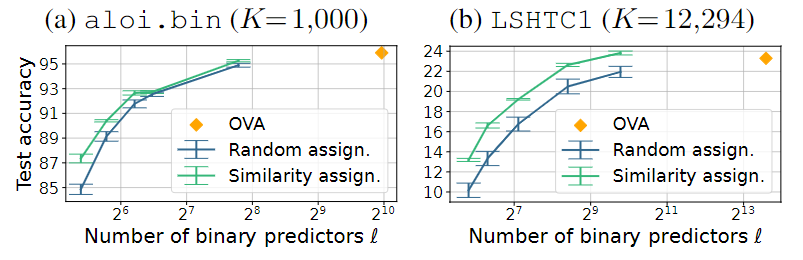

# W-LTLS

Implementation of the learning algorithm proposed in:  

[**Efficient Loss-Based Decoding On Graphs For Extreme Classification**](https://arxiv.org/abs/1803.03319) (NeurIPS 2018)
  
and the codeword-to-class assignment method proposed in:  

[**The Role of Codeword-to-Class Assignments in Error-Correcting Codes: An Empirical Study**](https://arxiv.org/abs/2302.05334) (AISTATS 2023).

A summary of our work can be found in the [NeurIPS 2018 Poster](https://github.com/ievron/wltls/blob/master/Poster.pdf).

Some of our ideas and methods are based on [Log-time and Log-space Extreme Classification](https://arxiv.org/abs/1611.01964) and its [code](https://github.com/kjasinska/ltls).

## Downloading the data

The multiclass datasets can be downloaded from [PD-Sparse](https://github.com/a061105/ExtremeMulticlass).

## Documentation

```
$ python3 wltls.py -h
usage: wltls.py [-h] [-slice_width SLICE_WIDTH]
                [-decoding_loss [{exponential,squared_hinge,squared}]]
                [-epochs EPOCHS] [-rnd_seed RND_SEED]
                [-path_assignment [{random,greedy}]]
                [-binary_classifier [{AROW,perceptron}]] [--plot_graph]
                [--sparse]
                {Dmoz,LSHTC1,aloi.bin,imageNet,sector} data_path model_dir

Runs a single W-LTLS experiment. See https://github.com/ievron/wltls/ for
documentation and license details.

positional arguments:
  {Dmoz,LSHTC1,aloi.bin,imageNet,sector}
                        Dataset name
  data_path             Path of the directory holding the datasets downloaded
                        from PD-Sparse
  model_dir             Path of a directory to save the model in (model.npz)

optional arguments:
  -h, --help            show this help message and exit
  -slice_width SLICE_WIDTH
                        The slice width of the trellis graph
  -decoding_loss [{exponential,squared_hinge,squared}]
                        The loss for the loss-based decoding scheme
  -epochs EPOCHS        Number of epochs
  -rnd_seed RND_SEED    Random seed
  -path_assignment [{random,greedy}]
                        Path assignment policy
  -binary_classifier [{AROW,perceptron}]
                        The binary classifier for learning the binary
                        subproblems
  --plot_graph          Plot the trellis graph on start
  --sparse              Experiment sparse models at the end of training
```

## Basic Example 

Our code can be run either by running the `example_run_basic.py` script or through the command prompt, as explained below.

Here we show how to train a W-LTLS model with a slice width of 5 on the `sector` dataset.
At the end of training, an experiment of sparse models is run.
Notice that a data directory in the following structure is required (as downloaded from [PD-Sparse](http://www.cs.utexas.edu/~xrhuang/PDSparse/)):
```
$ ls /data/sector/
sector.heldout  sector.heldout_sorted  sector.test  sector.test_sorted  sector.train  sector.train_sorted
```

Also, a (possibly large) file named `/temp/model.npz` is created during training.

```
$ python3 wltls.py sector /data /temp/ -slice_width 5 -rnd_seed 1337 --sparse
================================================================================
Learning a Wide-LTLS model.
================================================================================
Multi-class dataset 'sector':
	Loaded in:	2s
	Labels:		K=105
	Features:	d=55,197 (163.9 non-zero features on average)
================================================================================
Created a trellis graph with a slice width of b=5.
Created a heaviest path decoder with 55 edges.
Using a Random path assignment policy.
Using AROW as the binary classifier.
Decoding according to the exponential loss.
Model size: 11.6MB
================================================================================
Train epoch 1/5: 77.4% in 26s.	Validation: 92.6% (531ms).	Assigned 0 labels. Saved model (341ms).
Train epoch 2/5: 99.2% in 18s.	Validation: 93.5% (596ms).	Saved model (367ms).
Train epoch 3/5: 99.6% in 17s.	Validation: 93.5% (548ms).	
Train epoch 4/5: 99.7% in 15s.	Validation: 93.5% (546ms).	
Train epoch 5/5: 99.7% in 15s.	Validation: 93.5% (572ms).	
Test accuracy: 94.2% (717ms)
Average binary loss: 0.31
================================================================================
Preparing a final model (this may take some time)...
The final model created successfully.
The final model was tested in 319ms and achieved 94.8% accuracy.
================================================================================
Experimenting sparse models:
Original (unpruned) matrix weight: 11.6MB
  # | threshold | Non-zeros | Sparse mat. weight | Validation acc |
  1 | 0.0000000 |    75.44% |   17.7MB = 152.69% |         93.53% |
  2 | 0.0731570 |    25.15% |    6.0MB =  52.11% |         93.53% |
  3 | 0.0844701 |    22.13% |    5.3MB =  46.07% |         93.64% |
  4 | 0.0982297 |    19.11% |    4.6MB =  40.04% |         93.64% |
  5 | 0.1156456 |    16.09% |    3.9MB =  34.00% |         93.64% |
  6 | 0.1383815 |    13.07% |    3.2MB =  27.96% |         93.76% |
  7 | 0.1695736 |    10.05% |    2.5MB =  21.93% |         93.41% |
  8 | 0.2163143 |     7.04% |    1.8MB =  15.89% |         93.53% |
  9 | 0.3006442 |     4.02% |    1.1MB =   9.85% |         93.53% |
 10 | 0.5751046 |     1.00% |    0.4MB =   3.82% |         92.49% |
Stopping condition reached (excess validation accuracy degradation)!

Best model within allowed validation accuracy degradation:
#9. threshold=0.3006442, nonzeros:     4.02%, test accuracy: 94.38%
================================================================================
```

## Similarity preserving codeword-to-class assignments

The default behavior of our algorithm randomly assigns codewords (or paths in the coding DAG) to classes.  
In Evron et al. (2023), it is shown that assigning similar codewords to similar classes improves generalization. 



Therefore, our updated repository supports this option as well. 

We provide such an example in `example_run_basic.py` with a precomputed similarity preserving assignment.
We currently provide such assignments for `aloi.bin` and `LSHTC1`.    
To compute such an assignment for a new dataset, we need a class hierarchy in the form of a [networkx](https://networkx.org/) tree (DiGraph).
See the example in `example_compute_assignments.py`. 

More details can be found in Section 4.2 and Appendix F in Evron et al. (2023).

## Citation

1. If you use our code, please cite:  
Evron, Moroshko, and Crammer. [**Efficient Loss-Based Decoding On Graphs For Extreme Classification**](https://arxiv.org/abs/1803.03319). NeurIPS 2018.
    ```
    @article{evron2018efficient,
      title={Efficient loss-based decoding on graphs for extreme classification},
      author={Evron, Itay and Moroshko, Edward and Crammer, Koby},
      journal={Advances in Neural Information Processing Systems},
      volume={31},
      year={2018}
    }
    ```

2. If you also use the similarity-preserving codeword-to-class assignments, please also cite:  
Evron, Onn, Weiss Orzech, Azeroual, and Soudry. [**The Role of Codeword-to-Class Assignments in Error-Correcting Codes: An Empirical Study.**](https://arxiv.org/abs/2302.05334) AISTATS 2023.
    ```
    @inproceedings{evron2023assignments,
      title={The Role of Codeword-to-Class Assignments in Error-Correcting Codes: An Empirical Study},
      author={Evron, Itay and Onn, Ophir and Weiss Orzech, Tamar and Azeroual, Hai and Souudry, Daniel},
      booktitle={International Conference on Artificial Intelligence and Statistics},
      year={2023},
      organization={PMLR}
    }
    ```


## Contact

Feel free to contact us by email: itay(at)evron.me
